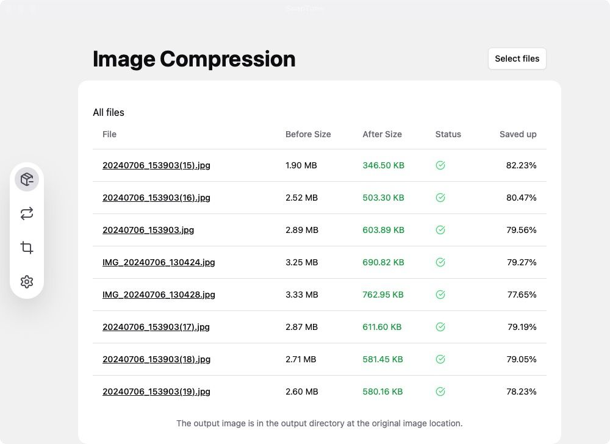

# SnapTune
[简体中文](./README_CN.md) | [English](./README.md)
## Introduction

`SnapTune` is a multi-platform image processing tool designed to provide convenient image processing features. Currently, it supports lossy compression of JPG and PNG images, with plans to support more features in the future, such as format conversion.

## Main Features

- [x] Lossy compression [jpg/png]
- [x] Format conversion
- [x] Image cropping
- [x] Image resizing
- [ ] More features...

## Installation

### From Source Code

1. **Clone the repository**

```
sh
git clone https://github.com/yourusername/SnapTune.git
cd SnapTune
```
Install dependencies

Ensure you have the Rust toolchain installed.

#### Ubuntu

```
sh
sudo apt install libwebp-dev libssl-dev libgtk-3-dev libsoup2.4-dev libwebkit2gtk-4.1-dev nasm libturbojpeg0-dev

export TURBOJPEG_STATIC=1
sh
pnpm tauri build
```
### From Binary Package

Click here to download: [SnapTune](https://github.com/kingzcheung/SnapTune/releases)

Note: I do not have a macOS signing certificate, so binary packages for macOS are not provided.

## Preview


## Other

If you want to use the online version of the lossy compression feature, please visit [https://tinypng.ximei.me](https://tinypng.ximei.me).
This is a pure front-end website that does not rely on backend services. It uses a WASM-based image compression algorithm.

## Contribution
Contributions and suggestions for improvement are welcome!

## License
This project is licensed under the GPL3 License.