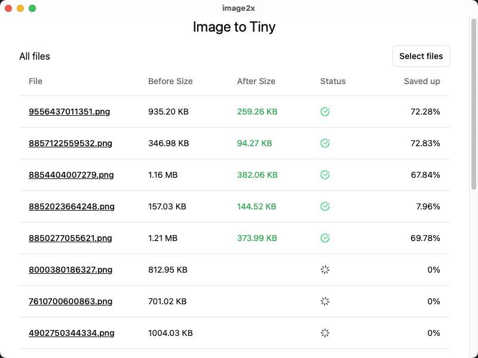

# image2x
[简体中文](./README_CN.md) | [English](./README.md)
## 介绍

`image2x` 是一个多平台图片处理小工具，旨在提供便捷的图片处理功能。目前支持有损压缩 JPG 和 PNG 图片，未来计划支持更多功能，如格式转换。

## 主要功能

- [x] 有损压缩 [jpg/png]
- [ ] 格式转换

## 安装

### 从源代码安装

1. **克隆仓库**

```sh
   git clone https://github.com/yourusername/image2x.git
   cd image2x
```
安装依赖

确保你已经安装了 Rust 工具链.


#### ubuntu

```sh
sudo apt install libwebp-dev libssl-dev libgtk-3-dev libsoup2.4-dev libwebkit2gtk-4.1-dev nasm libturbojpeg0-dev

export TURBOJPEG_STATIC=1

```


```
pnpm tauri build
```
### 从二进制包安装
> TODO

## 预览


## 其他

如果你想使用在线版本的有损压缩功能，请访问 [https://tinypng.ximei.me](https://tinypng.ximei.me)。
这是一个纯前端的网站，不依赖后端服务。它的原理是基于 WASM 实现的图片压缩算法。

## 贡献
欢迎贡献代码和提出改进建议！

## 许可
本项目采用 GPL3 License 许可证。